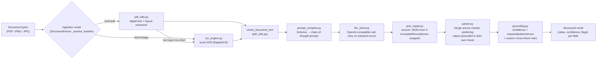
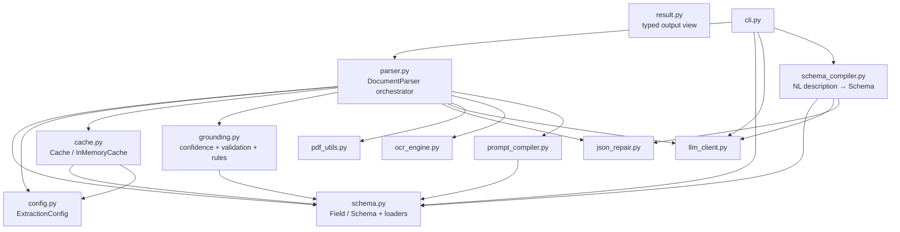
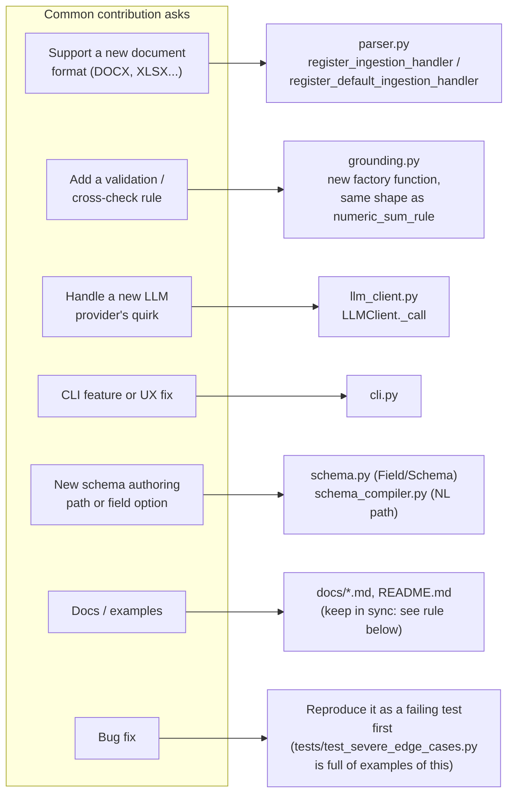

# Architecture

How a document turns into structured JSON, how the modules depend on each other, and where to make a change if you're contributing.

## 1. Pipeline: what happens to a document

Each box is one module with one job. A schema with a `list`-type field routes through `structured_mode`, which tags OCR/PDF-extracted lines with column position (`[X:nnn]`) so the LLM can tell columns apart. Those tags are stripped again before grounding checks run, since they're layout hints for the LLM, not document content.

## 2. Module dependency graph

`schema.py` and `config.py` sit at the bottom: nothing depends on them depending back, which is what makes them safe to import from anywhere without creating a cycle. `parser.py` is the only module that touches everything; if you're not sure where a change belongs, this graph tells you whether it's a leaf module (safe, isolated change) or `parser.py` (touches orchestration, so run the full suite, not just one test file).

## 3. Where to contribute

Each of these is a real, isolated entry point. None of them require touching `parser.py`'s orchestration logic except the "new document format" case, and even that's additive (register a handler, don't edit `extract()`).

## Why some things are shaped the way they are

A few decisions here look unusual out of context, worth knowing before "fixing" them:

- **`ExtractionConfig` is frozen** (`config.py`), deliberately. A bug here once came from two disconnected page-limit constants; a single, immutable config object closes that class of bug permanently.
- **`register_ingestion_handler` (instance method) and `register_default_ingestion_handler` (module function) are different names on purpose.** They used to share a name, which made it easy to call the process-wide one by habit when a scoped registration was intended.
- **Grounding's `numeric=`/`date=` flags are opt-in, not automatic** (`grounding.py`). An all-digit ID field (invoice number, container number) is a string identity, not a number; `"0100"` must not be treated as equal to `"100"`. Only fields declared `type: "number"/"currency"/"date"` get the tolerant comparison.
- **The regex-pattern timeout uses `SIGALRM`, not a thread or subprocess.** Both were tried and rejected. A thread's `join(timeout)` doesn't work (CPython's `re` engine holds the GIL during backtracking, so the timeout never fires). A subprocess works in isolation but crashed the whole process on exit here, because this app loads a native ML runtime (RapidOCR/onnxruntime) at OCR-init time and the two didn't coexist safely. See `grounding.py`'s `_regex_matches_with_timeout` docstring for the full story.
- **`__init__.py` doesn't lazy-load its re-exports beyond `ocr_engine`'s OCR engine itself.** `import fastdocparse` costs about 0.6s, mostly from the `openai` SDK's own import graph. This was measured, not guessed (see `ocr_engine.py`'s `HAS_RAPID_OCR`, which *is* lazy, via `importlib.util.find_spec`, because it used to add another 0.8s on its own).

See [CONTRIBUTING.md](../CONTRIBUTING.md) for the actual PR process, and [Output & Validation](output-format.md) for what each grounding flag means from a user's perspective.
